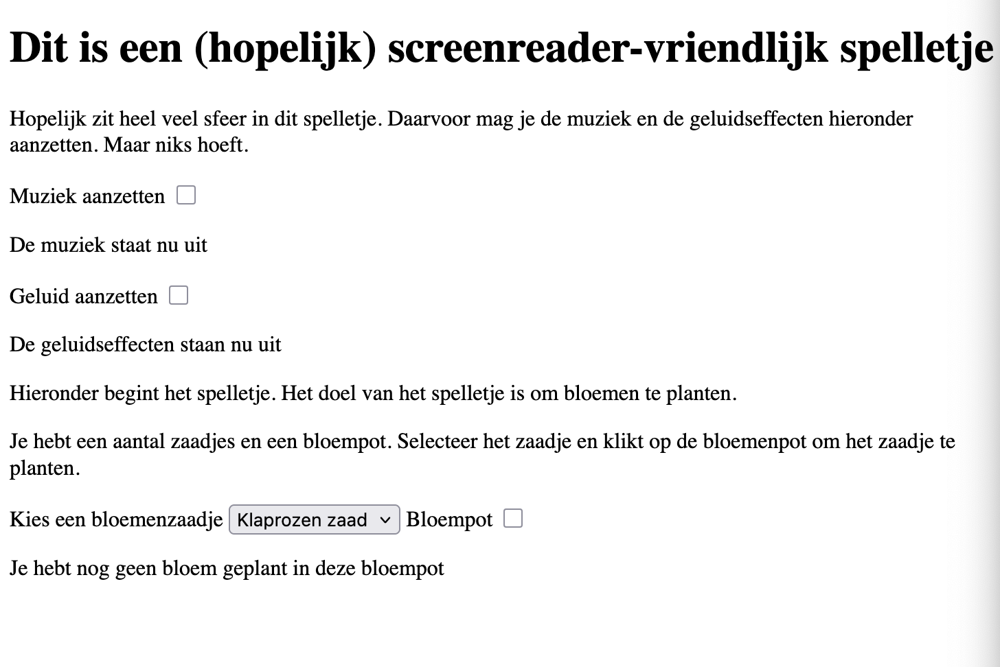
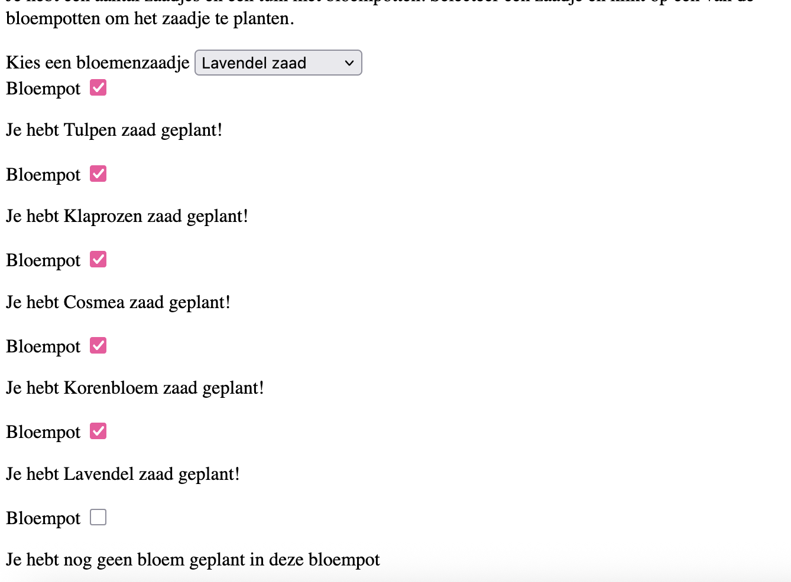

# Human Centered Design

Hoe maak je een Website voor één persoon met één specifieke beperking?

## Dag 1
Ik was ziek dus ik kon er helaas niet bij zijn

## Dag 2 
Wat heb ik vandaag gedaan?
- Weekly Geek
- Interview met Ihab

### Interview
Omdat ik ziek was had ik nog geen prototype maar ik heb wel veel gehad aan de vragen van andere mensen en ik heb ook zelf wat vragen gesteld, en op basis daarvan gekozen wat ik wilde maken.

Wat gebruikt hij?
- Hij gebruikt windows
- JAWS/NVDA

Muziek op basis van kleur prototype
- Geen stop knop voor muziek 
- Welke kleur en welke lettertype wordt aan welk geluid gekoppeld

Spraakberichten
- Doet hij vaak als hij geen tijd heeft om te typen
- Dicteren doet vaak heel raar
- Fijn om spraakberichten ontvangen maar duurt soms lang
- 4 minuten lang berichtjes zijn vervelend
- Soms te veel onderwerpen

- Hij typt terwijl de spraakbericht afgaat maar dan hoor je de bericht zelf niet meer
- Dus eigenlijk moet je ne elke vraag pauseren
- typen en spraakbericht gaan door elkaar heen
- sneltoets om te pauseren en sneller/langsamer af te spelen
- bookmark (hier was het interessant) -> hij zegt dat dat niet zo belangrijk is
- als je spraakbericht als een essay leest dan moet je gewoon een kortere spraakbericht sturen

Bij welke section wil je beginnen
- Kies je standaard begin punt
- Waarom zou je dat gebruiken in plaats van een menu balk want je navigeert er toch al heen
- Opslaan met cookies
- Keuzes aanvinken is niet handing voor links

Sela - sfeer bepalen met knop
- Liever knop in pagina of een knop in de pagina
- is het handig om te pitch te veranderen?
- een AI stem gebruiken om dingen voor te lezen, is dat handig?
- Engelse stem voor engelse tekst gebruiken (Alison kan beter Engels dan Xander)
- Is het handig om de sfeer te bepalen? Alleen als het een website is die niet alleen functioneel is, moet wel iets toevoegen wat bijdraagd, wat voegt deze knop echt toe?
- Voorleesknop: als je text-to-speech software heb is dat niet nodig, dus het voegt niet echt wat toe als het alleen maar dingen voorleest
- Kleuren voorlezen en omschrijving producten
- Je kan ook zeggen: ik wil een specifieke website omschrijven
- Wat zou voor hem bijdragen? Slecht leesbare dingen, plaatjes die niet omschreven zijn

Algemene vragen:
- Hoe gebruik jij het toestenbord en sneltoesten nu?
Hij heeft zijn eigen toetsenbord maar dat hoort niet uit te maken

- Een eigen website voor alleen maar sneltoetsen
Maakt het bruikbaarder dan handleiding want anders voegt het weer niks toe. Met AI zoeken naar sneltoetsen? Echt goed filteren. Maar je zou ook gewoon kunnen googelen of chatgpt vragen?

- Per screenreader of per browser?
Er zijn geen screenreaders van elke browsers. Edge kan het wel voorlezen maar de browser heeft geen ingebouwde screenreader
Browserspecifieke sneltoetsen
Screenreader en browser in Mac en Windows alles anders

- U gebruikt veel sneltoetsen. Er zijn website specifieke sneltoetsen hoe kom je daar achter?
Komt eigenlijk niet voor. Wel voor verschillende browsers

- Voorkeuren, als je op een website komt komt er een modal om te navigeren op de website, een sectie waarbij je kunt kiezen vanaf waar je gaat tabben. Shortcuts zelf bouwen om te skippen naar content. Zou je dat gebruiken?
Nee eigentlijk niet.. je kunt al tussen koppen skippen en naar volgende plaatje, knop, etc. Meeste websites hebben al een skip-to-content link

- Waar wil je dat de focus begint op een website?
Hangt er een beetje vanaf welke website het is, er is niet een goede optie

- Welke sneltoetsen zou je willlen die nog niet bestaan
Het zijn er al zo veel er hoeven niet echt meer te komen

- Gebruik jij websites liever op telefoon of laptop?
Hangt er vanaf waar je ben. Op laptop kun je dingen sneller regelen

- Als je artikelen leest voor politicologie wil je dan goed kunnen skippen?
Ja inhouds opgave enzo, hangt er van af hoe lang dat is
Extenties om te skippen in artikelen kan handig zijn

- Gebruikt u nog meer hulpmiddelen?
Alleen stok telefoon en laptop

- Wat is moeilijk om te gebruiken
Visuele interfaces zijn verschrikkelijk. Insta360 studio reageert op geen enkel input. Een groot plaatje

- Gebruikt u ooit een muis?
nee niet echt

- trukjes om minder toegankelijke websites te gebruiken?
Als knoppen geen labels hebben kun je het uit je hoofd leren wat die knoppen allemaal doen

- Is het handig om samenvattingen te krijgen voor spraakberichten?
Ja wel maar probleem met AI is privacy, je wil niet iemands gegevens zomaar in AI gooien. Stel iemand zit in een breakup dan wil je niet dat AI dat samenvat.

- Bepalen of iemand vaak sneltoetsen gebruikt, wat heb je eraan?
Weet ik ook niet. 

- Is dat nuttig om op te slaan waar je begint op een pagina?
Naja wel misschien maar als je het vaak bezoekt weet je al waar alles zit dus daar komt je sws als met een toets omdat je weet waar je heen moet. Maar als je websites eens in de zoveel tijd gebruikt en dan dingen opslaat sure why not

- Waar loop je zelf het vaakst tegen aan?
Vaker mobiele apps dan desktop apps maar gebeurd allemaal. Helemaal ontoegankelijk tot irritant om te gebruiken. Overzicht onbreekt vaak, samenvatting van wat er in de omgeving gebeurd, wat de essentie is van een pagina, alle linkjes en kort en bondig, wat is hier? Niet zo zeer gericht op navigatie maar essesntie en links

- Mitchell wil een extention die de manier van spreken kan aanpassen
Ja screenreaders zijn heel saai, de toekomst is waarschijnlijk dat dingen vervangen worden door AI stemmen, dat is wel leuk. Screenreaders zijn functioneel maar niet plesierig

- Waardoor raak je snel de draad kwijt op een website?
Slechte labels. Hij kan redelijk goed met technologie omgaan dus er zijn niet zo veel dingen waar hij tegen aanloopt, het moet gewoon goed functioneren

- Is de sfeer van een website belangrijk voor jou?
Als het voor plezier is kan het leuk zijn maar voor de noodzaak niet, niet bij belastingdienst. Screenreaders zijn heel functioneel dus ja er is geen sfeer. 

- Wat draagt gevoel van sfeer wel over?
Plaatjes omschrijven, knoppen...

- Stel dat links of knoppem geluiden maken zou dat leuk zijn?
Eventjes wel maar op een bepaald moment wordt het ook irritant. 

- Wanneer wil je wel sfeer?
Manier van schrijven, bij social media is er wel een sfeer, posts van mensen waar mensen echt wat te zeggen hebben. Bij social media zijn er persoonlijke verhalen dus daar ben je meer geïntereseerd in de sfeer. Een brand, een persoonlijke website. Producten voor je huis? Bij het shoppen? 

- Hoeveel tijd zou je aan de sfeer willen besteden?
minder dan een halfe minuut per pagina

- Hoe wil je de sfeer omschreven hebben?
Kleuren en layout, welke kleur heeft de pagina, is de tekst bold. Zitten er patrinen in de layout, hoe zien de icoontjes eruit, is dat belangrijk voor de sfeer? Wat versta je onder sfeer? Kun je instellen hoe gedetailleerd dingen omschreven moeten worden? Geluiden zijn ook belangrijk voor een sfeer? Kan leuk zijn maar gewoon niet te veel, aan en uit zetten moet mogelijk zijn. Geluid moet pas aangaan als je dat wilt, on command en niet tegelijkertijd met de screenreader.

- Zijn er extenties die je al gebruikt als hulpmiddel?
Nee

### Bevindingen
Eigenlijk zijn de meeste van de opdrachten die Berend heeft bedacht niet echt van toepassing voor Ihab. Ihab zei bij heel veel opdrachten, zoals een library van sneltoetsen maken, dat dat niet echt nodig was omdat je het ook gewoon kunt googelen. Verder zei hij dat hij niet echt met extensies werkt omdat hij goed genoeg kan omgaan met zijn screenreader en dat hij ook niet echt behoefte heeft aan extra functionaliteiten omdat alles wat al bestaat al goed genoeg is. 
Hij zei dat de screennreader wel heel eentonig is en de sfeer van een website niet goed weergegeven kan worden. Maar hij zei ook dat hij dat niet vaak mist, behalve op social media waar het om persoonlijke verhalen gaat. Maar ook personlijke websites en producten die je wilt kopen zouden fijner zijn als ze wat meer sfeervol omschreven worden.

Maar omdat hij dus eigenlijk geen behoefte heeft aan praktische dingen en alleen sfeer wil voor dingen die niet belangrijk zijn om te bedienen, wil ik iets onbelangrijks en onpraktischs maken: een spel! Maar dan screenreader-friendly

## Voorgang Week 1
Misschien kan ik werken met pitch en snelheid aanpassen. Knoppen kunnen al veel beter zijn als ze goed worden omschreven zoals hier https://www.ohra.nl/.
Ga iets kleins maken en dat heel goed uitwerken in plaats van iets groots wat niet goed werkt. Ga voor nu één functionaliteit uitwerken die je goed kunt testen. En ga niet te veel nadenken over wat hij wil want mensen weten vaak niet wat ze willen.

## Dag 3 
Ik had onderzoek gedaan naar screenreader-vriendelijke spelletjes en ik zag dat je stardew valley kon spelen met een screenreader door een mod toe te voegen. Dat heb ik gedaan en gekeken naar hoe ik met de screenreader kan omgaan om 

Vragen:
- Is het juist fijn om selects en inputs te gebruiken of moet ik beter met divs gaan werken die alleen tekst-gebaseerde informatie weergeven?
- Is het duidelijk dat het een spelletje is?
- Je kunt een heele tuin maken en verschillende bloemen planten die dan verschillende staten hebben, en ze groeien als je ze water geeft

## Dag 4
### Testen Prototype

Ik had dus een prototype gemaakt waarbij je uit drie zaden kunt kiezen en deze vervolgens planten in een bloempot. Daarnaast heb ik een knop toegevoegd voor muziek en geluidseffecten.

Ihab teste de website. Daarbij viel mij op dat hem niet gelijk duidelijk was wat de geluidseffecten zijn dus dat zal ik aanpassen en duidelijker maken.

Ik vroeg verder vooral of het een fijne ervaring voor hem was om met de selectie dropdown en de checkboxes te werken voor de zaden en de bloempot. Hij zei dat dat duidelijk was.

Hij zei dat het concept leuk was maar dat ik het nu nog leuker en echt interactief moet maken.

Hij stelde zelf een aantal dingen voor die ik ook al wilde doen:

- een hele tuin kunnen maken
- tonen wanneer planten water nodig hebben
- beschrijving van de bloemen in de verschillende staten

Verder stelde hij voor om:

- een overzicht van alle geplante bloemen te maken
- tonen hoe lang bloemen al geplant zijn
- een mogelijkheid te hebben om nieuwe bloemen te maken

Hij zei dat het hem niet perse nodig leek om rond te kunnen lopen.

### Milas test

Wat is sfeer:
- Achtergrond
- Kleur van tekst
- Vrolijk vs niet vrolijk
- Toonhoogte en ritme screenreader
- Xander voor Nederlands, Alison voor Engels

### Wat heb ik vandaag gedaan?
- Testen met Ihab
- Prototype verder uitwerken zodat er meer bloempotten zijn waarin je verschillende bloemen kunt planten

## Voortgang Week 2
- Scherm kan ik ook zwart maken want het is toch voor Ihab
- Werken met aria labels en aria roles
- Veel overzicht toevoegen want hij ziet natuurlijk niks
- Spelen met HTML elementen want hij is er heel goed in
- Echt door de tuin lijden, zoiets van "Welkom, je staat nu bij de deur. Je loopt nu langs het pad. Je kijkt naar al je bloemen. OVERZICHT deze bloemen heb jij allemaal. Oh nee deze bloem heeft water nodig. Je moet de gieter pakken."
- met aria live polite een bij laten verschijnen? of vlinders?
- Zaden zitten in je tuinhuisje die moet je vanuit daar pakken ofzo

## Smashing Conferentie
### Test met Jules Ernst

Ik heb op de Smashing Conference met Jules Ernst gesproken, een toegankelijkheids-expert die al meer dan 20 jaar bezig is met digitale toegankelijkheid. Ik heb mijn website aan hem laten zien. 

- Aria-labelledby section overbodig
- Aria-polite is prima voor de meeste dingen, maar voor verandering in het bloembed kun je ook 
- Ik moet nadenken over hoe een screenreader gebruiker eerst door de hele website heengaat en daarna weer boven begint.
- Misschien is het handig om een melding te maken die alles aangeeft in plaats van een aparte melding voor elk bloembed, en die melding moet dan assertive. Deze melding moet op een lager niveau dan de tuin
- Bloemzaad als kopniveau in de tuin en niet daarbuiten
- Overzicht pas aan het einde, maar ook; hoe weet de gebruiker dat het overzicht veranderd
- In het overzicht weer linkjes naar boven naar de zaadjes

En: misschien is het handig om het tuinieren en de tuin apart te hebben!

## Dag 5
Wat heb ik vandaag gedaan?
- Checkout gedaan met Sabrina
- Ik heb de feedback van Jules verwerkt een een aparte tuin en tuinier sectie gemaakt. Maar ik heb wel ook mijn oude design erin gelaten om aan Ihab te vragen welke hij fijner vindt. 

## Vragen voor Ihab
- wil je een aparte select voor elke bloem of juist eentje waar al je bloemzaden zitten?
- vind je het fijn als de focus redirect wordt?
- fijner om overzicht bij bloempot zelf te hebben en bij de bloempot zelf te tuinieren OF wil je juist tuinieren en bloempot apart
- hoe weet je dat het overzicht veranderd? 
- moet je springen naar zaden als dingen veranderen? hoe weet je of dingen veranderen?
- waar moet je springen als dingen veranderen? hoe moet je springen? 

## Dag 6 
### Test met Ihab
Mitchell:
- popover werkt niet
- meerdere stemmen tergelijk
- reizen muziek sport anime lezen
- 